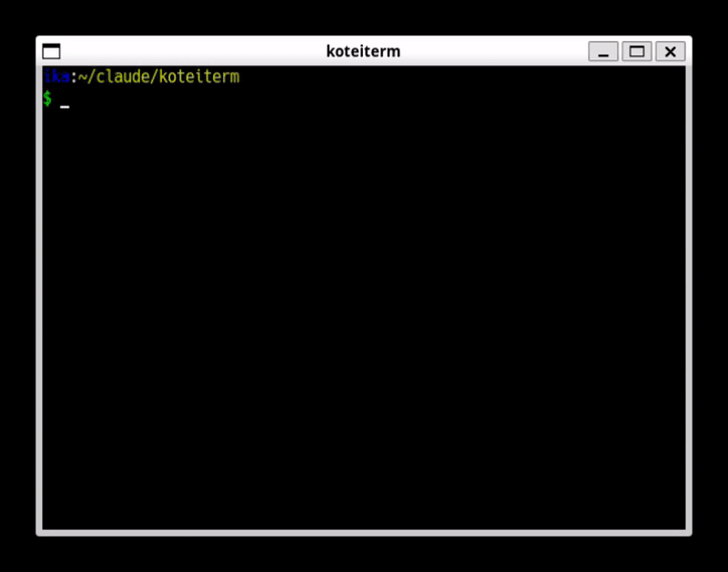
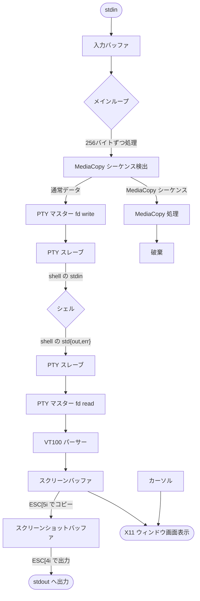

# koteiterm

シンプルなLinuxターミナルエミュレータ



## 概要

koteitermは、X11とXftを使用したC言語製のターミナルエミュレータです。VT100エスケープシーケンス、ANSI 16色、UTF-8/日本語表示、Nerd Fontsアイコンをサポートしています。

## ビルド

### 基本的な依存関係

```bash
sudo apt-get install \
  libx11-dev libxft-dev libfontconfig1-dev \
  libfreetype6-dev libimlib2-dev libgif-dev
```

### WSL/Windows環境でのクリップボード連携

WSL環境でWindowsクリップボードと連携する場合、MinGWクロスコンパイラが必要です：

```bash
sudo apt-get install mingw-w64
```

Makefileが自動的にWSL環境を検出し、winclip.exeをビルドします。

### ビルドと実行

```bash
make
./koteiterm
```
## マウス操作

 |操作|機能|
  |---|---|
  |左ボタンドラッグ|テキスト選択|
  |中ボタンクリック|貼り付け（クリップボード）|
  |マウスホイール|スクロール|

### クリップボード動作
- **ネイティブLinux環境**: X11のPRIMARY/CLIPBOARD選択を使用（標準的なLinux動作）
- **WSL環境**: WindowsクリップボードとX11クリップボードの両方に対応
  - 選択したテキストがWindowsクリップボードにも自動コピーされます
  - 中ボタンクリックでWindowsクリップボードから貼り付け可能

## 起動オプション

```bash
./koteiterm --help           # ヘルプを表示
./koteiterm --version        # バージョン情報を表示

# 色の指定
./koteiterm -fg <color>      # 前景色を指定
./koteiterm -bg <color>      # 背景色を指定
./koteiterm -cr <color>      # カーソル色を指定
./koteiterm -selbg <color>   # 選択背景色を指定
./koteiterm -selfg <color>   # 選択前景色を指定

# カーソル形状の指定
./koteiterm --cursor bar        # 左縦線（デフォルト）
./koteiterm --cursor underline  # 短いアンダーライン
./koteiterm --cursor hollow     # 中抜き四角
./koteiterm --cursor block      # 中埋め四角

# 画像(透過PNG/透過アニメGIF, 左下が基準点です)
./koteiterm --cursor "path/to/image.png" 
./koteiterm --cursor "path/to/image.png:2:4"     # オフセットx:y [pixels]
./koteiterm --cursor "path/to/image.png:2:4:0.5" # スケール [倍]

# 256色モードの切り替え
./koteiterm --256color  # 256色モード(デフォルトはtruecolor)
./koteiterm --debug     # stdoutにデバッグ情報を表示
./koteiterm --debug-key # stdoujにキー入力のデバッグ情報を表示
```

## stdin入力

koteitermは、パイプやファイルリダイレクト経由でstdinからコマンドを受け取ることができます：

```bash
# パイプ経由でコマンド送信
echo "ls -la" | ./koteiterm

# ファイルリダイレクト
./koteiterm < commands.txt

# 複数コマンド
printf "pwd\nls\ndate\n" | ./koteiterm
```

**動作仕様:**
- stdinが端末（tty）の場合：X11キーボード入力のみを使用（通常モード）
- stdinがパイプまたはファイルの場合：メインループでselectを使ってstdinからの入力をストリーム読み取り
- データが到着次第、順次処理される（事前の全データ読み込みは行わない）
- stdinがEOFに達しても、ターミナルウィンドウは開いたまま（キーボード入力は継続可能）

**時系列制御が必要な場合:**

通常のbashパイプ（`(echo "cmd"; sleep 1; echo "next") | ./koteiterm`）では、サブシェル内の全出力が即座にパイプバッファに書き込まれるため、sleepによるタイミング制御はできません。

時系列制御が必要な場合（例：スクリーンショット機能のテスト）は、named pipeを使用してください：

```bash
# named pipeを作成
mkfifo /tmp/kotei_input

# koteitermを起動
./koteiterm < /tmp/kotei_input > output.txt &

# 別のターミナルまたはスクリプトから段階的に入力
exec 3> /tmp/kotei_input
echo "ls --color=always" >&3
# （任意の待機時間）
printf "\033[5i\033[4i" >&3  # スクリーンショット
exec 3>&-  # 終了

# クリーンアップ
rm /tmp/kotei_input
```

**ワンライナーの例:**

```bash
# lsコマンドのスクリーンショット
mkfifo /tmp/k; (echo "ls --color=always"; sleep 1.5; printf "\x1b[5i\x1b[4i"; sleep 0.5) > /tmp/k & timeout 6 ./koteiterm < /tmp/k > ls_screenshot.txt 2>&1; rm /tmp/k

# vimのウェルカム画面スクリーンショット
mkfifo /tmp/k; (echo "vim"; sleep 2.5; printf "\x1b[5i\x1b[4i"; sleep 0.5) > /tmp/k & timeout 8 ./koteiterm < /tmp/k > vim_screenshot.txt 2>&1; rm /tmp/k
```

## スクリーンショット機能 (Media Copy)

VT220のMedia Copy機能により、画面内容をテキストとして出力できます。koteitermは、stdinとstdout（シェル出力）の**両方**からMCシーケンスを処理します。

**エスケープシーケンス:**
- `ESC[5i` - 現在の画面内容をキャプチャ
- `ESC[4i` - ANSIエスケープシーケンス付きで出力（デフォルト）
- `ESC[4;0i` - プレーンテキストで出力

**基本的な使用例:**
```bash
# stdin から MC シーケンスを送信してスクリーンショット
printf 'ls --color=always\n\033[5i\033[4i' | ./koteiterm > screenshot.txt

# プレーンテキスト（色なし）で出力
printf 'ls --color=always\n\033[5i\033[4;0i' | ./koteiterm > screenshot_plain.txt

# 複数コマンドの実行結果をキャプチャ
printf 'pwd\nls\n\033[5i\033[4i' | ./koteiterm > output.txt
```

**応用例:**
```bash
# システム情報をキャプチャして保存
echo -e "neofetch\n\033[5i\033[4i" | ./koteiterm > system_info.txt

# シェル出力からの MC シーケンス（アプリケーションが MC を出力する場合も動作）
# 注: stdin からの MC はシェルに送られず、koteiterm が直接処理します
```

### データフロー

koteiterm 内部でのデータの流れを以下に示します：



**主要な処理フロー:**
1. **stdin → koteiterm**: パイプ入力を `g_stdin_buffer` に読み取り
2. **MC シーケンス検出**: `find_mc_sequence()` で ESC[5i/4i/4;0i を検出・分岐
3. **PTY 経由**: 通常データは `pty_write()` でシェルに送信
4. **シェル実行**: bash/zsh がコマンドを実行し、結果を出力
5. **PTY から受信**: `pty_read()` でシェルの出力を受け取り
6. **VT100 パース**: `terminal_write()` でエスケープシーケンスを解析
7. **スクリーンバッファ**: `g_terminal.cells[]` にセル情報を格納
8. **画面描画**: X11 + Xft で文字と色を描画
9. **MC 処理**: ESC[5i でキャプチャ、ESC[4i で stdout に出力

### 色の指定方法

 | 指定方法|例|
  |---|---|
  |色名|`red`, `blue`, `white`, `black` など|
  |#RGB形式|`"#f00"` (赤), `"#0f0"` (緑), `"#00f"` (青)|
  |#RRGGBB形式|`"#ff0000"` (赤), `"#00ff00"` (緑), `"#0000ff"` (青)|
  |rgb:RR/GG/BB形式|`rgb:ff/00/00` (赤)|
  |rgb:RRRR/GGGG/BBBB形式|`rgb:ffff/0000/0000` (赤)|

---

## 現在サポートしている機能

### テストされたOS
- ✅ Ubuntu 22.04 LTS (WSL2)
- ✅ OpenBSD

### VT100エスケープシーケンス
- ✅ カーソル移動
  - CUU (ESC[A): カーソルを上に移動
  - CUD (ESC[B): カーソルを下に移動
  - CUF (ESC[C): カーソルを右に移動
  - CUB (ESC[D): カーソルを左に移動
  - CUP (ESC[H): カーソル位置設定
  - CNL/CPL/HPA/VPA: 追加のカーソル制御
- ✅ 画面クリア
  - ED (ESC[J): 画面の一部または全体をクリア
  - EL (ESC[K): 行の一部または全体をクリア
- ✅ SGR（色と文字属性）
  - **256色対応**（前景色・背景色、ESC[38;5;NmとESC[48;5;Nm）
  - ANSI 16色、6x6x6 RGB色空間（216色）、グレースケール（24段階）
  - 太字、イタリック、下線、反転表示
- ✅ 高度な機能
  - **代替スクリーンバッファ** (ESC[?1049h/l, ESC[?47h/l)
  - **スクロール領域設定** (DECSTBM: ESC[r)
  - **カーソル位置保存・復元** (DECSC: ESC 7, DECRC: ESC 8)
  - **カーソル表示/非表示** (ESC[?25h/l)
  - **行の挿入・削除** (IL: ESC[L, DL: ESC[M)
  - **文字の挿入・削除** (ICH: ESC[@, DCH: ESC[P)
  - **デバイス問い合わせ** (DSR: ESC[6n)
  - **スクロールコマンド** (SU: ESC[S, SD: ESC[T)
- ✅ 基本的な制御文字
  - \\n (改行)
  - \\r (キャリッジリターン)
  - \\b (バックスペース)
  - \\t (タブ)

### スクロール機能
- ✅ スクロールバック履歴（1000行）

### フォント
- ✅ デフォルト: HackGen Console NF（日本語+Nerd Fonts統合フォント）
- ✅ 日本語とNerd Fontsアイコンを同一フォントで表示
- ✅ WSL環境でWindowsフォントにアクセス可能
- ✅ fontconfig言語ヒント（`:lang=ja`）で日本語フォント優先

## ライセンス

MIT License

Copyright (c) 2025 koteitan

詳細は [LICENSE](LICENSE) ファイルを参照してください。

## 免責事項

本ソフトウェアは「現状のまま」提供されており、明示的または黙示的を問わず、いかなる保証も行いません。本ソフトウェアの使用により生じたいかなる損害についても、著作権者および貢献者は一切の責任を負いません。

使用者は本ソフトウェアを自己の責任において使用するものとします。
